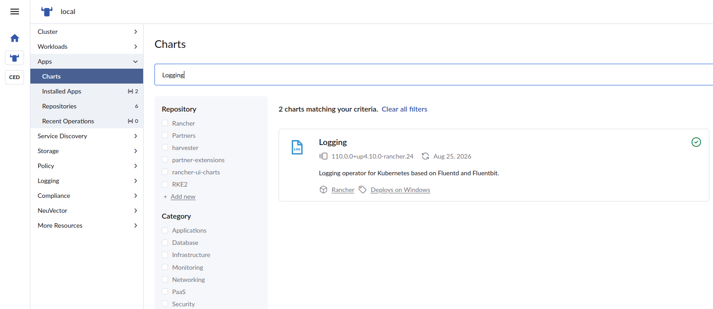
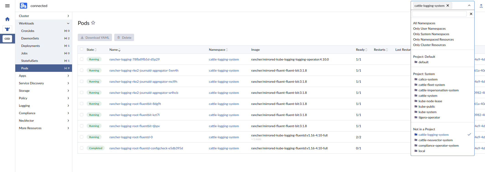

# Install Logging Operator
- In the Rancher UI, select the cluster you want to enable logging for in the left pane, then go to Apps in the menu.
- In the search block type in `Logging` then select the Logging Operator that shows up.

- On the next page that comes up click on the blue box that says `+ Install this version`
- You do not need to make any changes on the next page, so click on `Proceed` in the lower right.
- The next page gives you the option to set the Docker Root Directory, and adjust systemd Log Path.  Neither needs adjusting so simply click on `Install` in the lower right.
- Wait for the operator to show as Deployed in the `Installed Apps` page that comes up.
- From there, open Workloads on the left and select Pods.  In the upper right select `cattle-logging-system` namespace.
- Ensure that all the pods are running.  If any of the `rancher-logging-rke2-journald-aggregator` pods end up in a Crash Loop Backoff, then there is an issue with SELinux blocking the pods that may require putting SELinux in Permissive mode, until SUSE completes the SELinux contexts to fix this issue on SLE-Micro OS.
